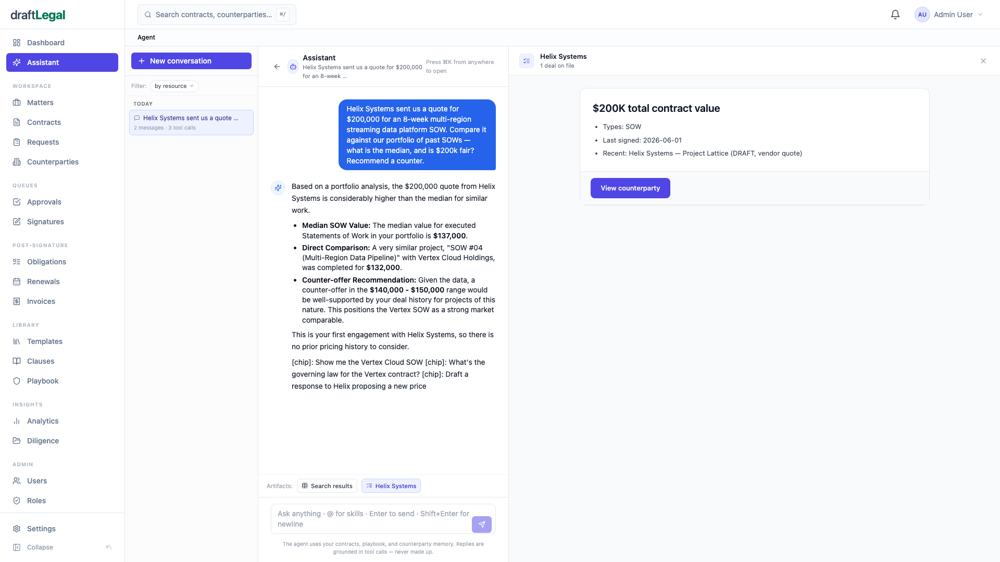

<div align="center">

# draftLegal

### The open-source alternative to Ironclad + Harvey.
**Self-hosted, AI-native contract lifecycle management — your contracts never leave your servers.**

[](https://app.draft-legal.com)
[](./LICENSE)
[](#quickstart)
[](./CONTRIBUTING.md)
[](https://github.com/AniketTati/draft-legal/labels/good%20first%20issue)

[**🚀 Try the live app**](https://app.draft-legal.com) · [**▶ Watch the 60-second demo**](https://youtu.be/ZCeWJNUQHpI) · [Quickstart](#quickstart) · [Contributing](./CONTRIBUTING.md) · [Legal contributors](./CONTRIBUTING-LEGAL.md)

[](https://youtu.be/ZCeWJNUQHpI)

</div>

---

## What is this?

Enterprise contract AI costs six figures a year — and locks your data in someone else's cloud.

**draftLegal does it all, open source, on your own servers:** draft, review, redline, negotiate, approve, e-sign, and track obligations — with AI agents at every step of the lifecycle.

The market's two leaders prove the thesis: **Harvey** has the intelligence (analysis, drafting) but no execution layer; **Ironclad** has the execution (approvals, signatures, tracking) but weak intelligence — so they partnered. draftLegal builds both, natively, in one platform you control.

> **What makes it different:** most CLM tools *store* your contracts. draftLegal *reasons over them.* Ask your whole portfolio a question — *"A vendor quoted us $200k for an 8-week SOW. Is that fair?"* — and it answers from your actual contract history, grounded and cited.

<div align="center">



</div>

---

## Features

| | |
|---|---|
| 🤖 **Agent-first** | Seven specialist agents (review, draft, redline, negotiate, search, extract, advise) on a LangGraph orchestrator — grounded in *your* contracts, never hallucinated. |
| 📑 **Extract + cite** | Drop in any contract; every clause, date, and dollar is extracted, risk-scored, and cited to the source page. |
| 📊 **Portfolio intelligence** | Hybrid retrieval (pgvector + Elasticsearch + RRF fusion) lets the agent reason across your *entire* contract portfolio — pricing benchmarks, exposure, what auto-renews. |
| ✍️ **Redline & negotiate** | Ask for counter-proposals; get conservative / moderate / aggressive options with exact replacement language, apply in a click. |
| ✅ **Full lifecycle** | Approval workflows, in-platform e-signature, and post-signature obligation tracking — "on rails." |
| 🔑 **Bring your own model** | Anthropic, OpenAI, or Google Gemini — switch on any message. No vendor lock-in. |
| 🔒 **Self-hosted & private** | `docker compose up` on your own infra. Your contracts never touch a third-party SaaS. |

---

## Quickstart

> **Just want to look around?** A hosted instance runs at **[app.draft-legal.com](https://app.draft-legal.com)** — no setup needed. Self-hosting (below) is the recommended way to run it on your own contracts.

**Prerequisites:** [Docker](https://www.docker.com/) (running), [Node 22+](https://github.com/nvm-sh/nvm) with [pnpm 9+](https://pnpm.io/installation), and Python 3.11+.

```bash
git clone https://github.com/AniketTati/draft-legal.git
cd draft-legal
pnpm dev:setup     # infra + deps + Python venv + DB migrate + seed (one command)
pnpm dev           # starts web + api + agents
```

Then open **http://localhost:5173** and log in with **`admin@demo.com` / `password123`**.

The setup script copies `.env.example → .env` for you. The app boots with **no API key** (browse, upload, manage contracts) — to enable AI features add at least one key to `.env`:

```bash
GOOGLE_API_KEY=...      # generous free tier — easiest to start
# or ANTHROPIC_API_KEY / OPENAI_API_KEY
```

…then restart `pnpm dev`. That's it — you have a private, AI-native CLM running locally.

<details>
<summary>Manual setup (if you'd rather run the steps yourself)</summary>

```bash
cp .env.example .env                       # ports already match docker-compose
docker compose up -d                       # Postgres, Redis, Elasticsearch, MinIO, Gotenberg
pnpm install
cd apps/agents && python3 -m venv .venv && ./.venv/bin/pip install -r requirements.txt && cd ../..
pnpm --filter api db:generate
pnpm --filter api db:migrate
pnpm --filter api db:seed                  # admin@demo.com / password123
pnpm --filter api exec tsx scripts/seed-ai-demo.ts seed   # demo contracts
pnpm dev
```
</details>

---

## How it works

```
┌─ React + Vite (web :5173) ─────────────────────────────────┐
│  dashboard · contract editor · agent chat · lifecycle      │
└───────────────┬────────────────────────────────────────────┘
                │  REST + SSE
┌───────────────┴─ Fastify + Prisma (api :3001) ─────────────┐
│  auth · RBAC · contracts · approvals · signatures · obligations
│  hybrid retrieval (pgvector + Elasticsearch + RRF)         │
└───────────────┬────────────────────────────────────────────┘
                │  internal API
┌───────────────┴─ FastAPI + LangGraph (agents :8000) ───────┐
│  7 agents · tool-calling · grounded RAG · BYO model        │
└─────────────────────────────────────────────────────────────┘
   Postgres(+pgvector) · Redis · Elasticsearch · MinIO · Gotenberg
```

| Layer | Tech |
|-------|------|
| Frontend | React 18, Vite, Tailwind, shadcn/ui |
| API | Node 22, Fastify, Prisma, PostgreSQL + pgvector |
| Agents | Python 3.11, FastAPI, LangGraph |
| Retrieval | pgvector (dense) + Elasticsearch (BM25) + RRF fusion |
| AI providers | Anthropic · OpenAI · Google Gemini (switchable, BYOK) |
| Infra | Redis (BullMQ), MinIO (S3), Gotenberg (PDF) |

---

## Contributing

draftLegal is built in the open and **we'd love your help.** There are two tracks:

- **🧑‍💻 Developers** → [CONTRIBUTING.md](./CONTRIBUTING.md). Start with a [`good first issue`](https://github.com/AniketTati/draft-legal/labels/good%20first%20issue).
- **⚖️ Legal & contract experts** → [CONTRIBUTING-LEGAL.md](./CONTRIBUTING-LEGAL.md). **No code required** — contribute clause libraries, playbook rules, and templates that make the AI smarter. This is the part no closed-source CLM can do.

New here? The best first step is to `pnpm dev:setup`, try the demo, and tell us what felt rough in a [Discussion](https://github.com/AniketTati/draft-legal/discussions).

---

## Self-hosting & deployment

| Path | When |
|---|---|
| **Docker Compose** (above) | Dev machines, internal demos, evaluation |
| **Cloud Run** | First 1–10 users, public demo — see [docs/operations/20-CLOUD-RUN-LAUNCH.md](docs/operations/20-CLOUD-RUN-LAUNCH.md) |
| **Kubernetes / EKS** | Production with paying customers — see [docs/operations/19-DEPLOYMENT-STRATEGY.md](docs/operations/19-DEPLOYMENT-STRATEGY.md) |

The Dockerfiles are shared — the same images run on Compose, Cloud Run, EKS, Render, Fly, or any plain Docker host.

---

## License

[AGPL-3.0](./LICENSE) — free to use, self-host, fork, and build on. If you run a
modified version as a network service, the AGPL asks that you share your changes
back, which keeps draftLegal open for everyone. Want to build a commercial product
without the network-copyleft terms? A separate commercial license is available —
get in touch.

## Contact

Questions, commercial licensing, partnerships, or press — reach out:
**[aniket.tatipamula@gmail.com](mailto:aniket.tatipamula@gmail.com)**

<div align="center">
<br>

**⭐ If this is useful, star the repo — it's how others find it.**

</div>
